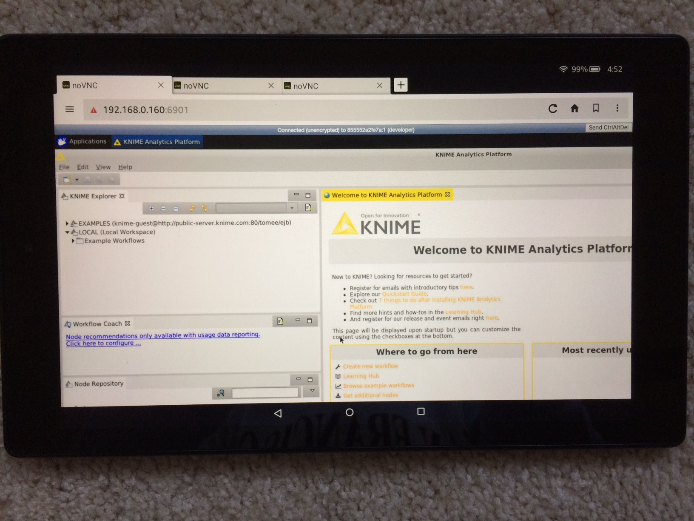
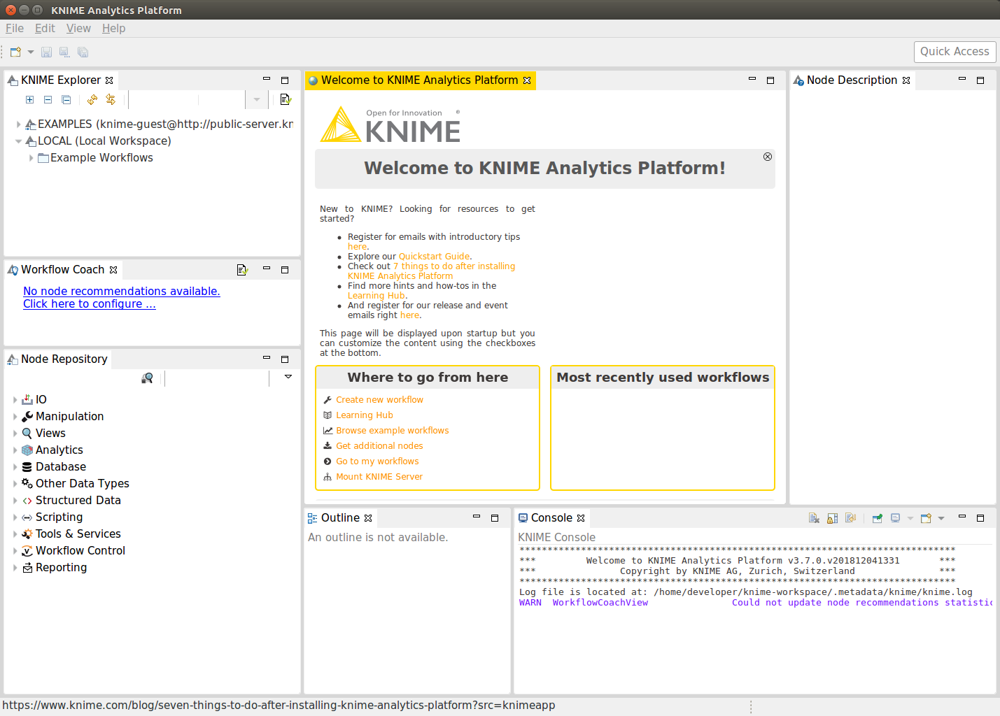

# KNIME Analytics Platform with VNC/noVNC for Container Cluster Platforms (Openshift, Kubernetes, etc.)
[](https://microbadger.com/images/openkbs/knime-vnc-docker "Get your own image badge on microbadger.com") [](https://microbadger.com/images/openkbs/knime-vnc-docker "Get your own version badge on microbadger.com")

KNIME (latest/3.7.1 + Java 8 (1.8.0_202) JDK + Maven 3.6 + Python 3.5 + PIP3 19 + + npm 6 + node 11 + Gradle 5.2

# Components:
* [KNIME Analtyics Platform](https://www.knime.com/download-knime-analytics-platform-sdk): latest (v 3.7.0) for Machine Learning & Big Data Analytics
* java version "1.8.0_202"
  Java(TM) SE Runtime Environment (build 1.8.0_202-b08)
  Java HotSpot(TM) 64-Bit Server VM (build 25.202-b08, mixed mode)
* Apache Maven 3.6.0
* Python 3.5.2 / Python 2.7.12 + pip 19.0.3
* Node v11.11.0 + npm 6.7.0 (from NodeSource official Node Distribution)
* Gradle 5.2
* Other tools: git wget unzip vim python python-setuptools python-dev python-numpy 
* VNC / noVNC: for VNC Client/Viwer / Browser-based VNC (noVNC)

# Run (recommended for easy-start)
Image is pulling from openkbs/knime-vnc-docker a
```
./run.sh
```

## Mobile devices and Desktop PC supported / tested:
* SmartPhones: tested ok! iPhone5 Safari works though phone screen size being too small vs the desired HD 1920x1080. It should work across all the smartphones with HTML5-capable brwosers. Hence, to access with small phone screen, run with VNC_RESOLUTION=800x600 (or adjust it to fit your phone's screen size).
* Tablets: tested ok! Amazon Fire with noVNC works!. It should work across all the tablets with HTML5-capable brwosers.

* Desktop PC or MacBook: tested ok! It should work across all PCs Desktop with HTML5-capable brwosers. 

## Connect to VNC Viewer/Client or noVNC (Browser-based VNC)
* connect via VNC viewer localhost:5901, default password: vncpassword
* connect via noVNC HTML5 full client: http://localhost:6901/vnc.html, default password: vncpassword
* connect via noVNC HTML5 lite client: http://localhost:6901/?password=vncpassword

Once it is up, the default password is "vncpassword" to access with your web browser:
```
http://<ip_address>:6901/vnc.html,
e.g.
=> Standalone Docker: http://localhost:6901/vnc.html
=> Openshift Container Platform: http://<route-from-openshift>/vnc.html
=> Kubernetes Container Platform: (similar to the Openshift above!)
```
# Run - Override VNC environment variables 
The following VNC environment variables can be overwritten at the docker run phase to customize your desktop environment inside the container. You can change those variables using configurations CLI or Web-GUI with OpenShift, Kubernetes, DC/OS, etc.
```
VNC_COL_DEPTH, default is 24 , e.g., change to 16,
    -e VNC_COL_DEPTH=16
VNC_RESOLUTION, default: 1920x1080 , e.g., change to 1024x800
    -e VNC_RESOLUTION=1280x1024
VNC_PW, default: vncpassword , e.g., change to MySpecial!(Password%)
    -e VNC_PW=MySpecial!(Password%)
```

# Screen (Desktop) Resolution
Two ways to change Screen resolutions.

## 1.) Modify ./run.sh file
```
#VNC_RESOLUTION="1280x1024"
VNC_RESOLUTION="1920x1280"
```

## 2.) Customize Openshift or Kubernetes container run envionrment
```
Set up, say, VNC_RESOLUTION with value 1920x1280
```

# Build
You can build your own image locally.
```
./build.sh
```

# References
* [KNIME](https://www.knime.com)
* [KNIME Analytics Platform](https://www.knime.com/download-knime-analytics-platform-sdk)
* [KNIME FAQ](https://www.knime.com/faq#q6)

# VNC/noVNC Resources
* [VNC Viewer / Client](https://www.realvnc.com/en/connect/download/viewer/)
* [TightVNC](https://www.tightvnc.com/download.php)

# See also VNC/noVNC docker-based IDE or Analytics Platform
* [consol/ubuntu-xfce-vnc](https://hub.docker.com/r/consol/ubuntu-xfce-vnc/)
* [openkbs/eclipse-photon-vnc-docker](https://hub.docker.com/r/openkbs/eclipse-photon-vnc-docker/)
* [openkbs/knime-vnc-docker](https://hub.docker.com/r/openkbs/knime-vnc-docker/)

# See also docker-based IDEs
* [openkbs/rapidminer-docker](https://cloud.docker.com/u/openkbs/repository/docker/openkbs/rapidminer-docker)
* [DrSnowbird/distributedWekaSpark](https://github.com/DrSnowbird/distributedWekaSpark)
* [openkbs/docker-atom-editor](https://hub.docker.com/r/openkbs/docker-atom-editor/)
* [openkbs/eclipse-photon-docker](https://hub.docker.com/r/openkbs/eclipse-photon-docker/)
* [openkbs/eclipse-oxygen-docker](https://hub.docker.com/r/openkbs/eclipse-oxygen-docker/)
* [openkbs/intellj-docker](https://hub.docker.com/r/openkbs/intellij-docker/)
* [openkbs/netbeans9-docker](https://hub.docker.com/r/openkbs/netbeans9-docker/)
* [openkbs/netbeans](https://hub.docker.com/r/openkbs/netbeans/)
* [openkbs/papyrus-sysml-docker](https://hub.docker.com/r/openkbs/papyrus-sysml-docker/)
* [openkbs/pycharm-docker](https://hub.docker.com/r/openkbs/pycharm-docker/)
* [openkbs/scala-ide-docker](https://hub.docker.com/r/openkbs/scala-ide-docker/)
* [openkbs/sublime-docker](https://hub.docker.com/r/openkbs/sublime-docker/)
* [openkbs/webstorm-docker](https://hub.docker.com/r/openkbs/webstorm-docker/)

# Eclipse issues
* You might see WARNING message in the log from Eclipse for class not found. It has not impact in VNC or the KNIME tools. However, it might needs to be fixed by KNIME product team. We will not address here it for now.
```
WARNING: Aries Blueprint packages not available. So namespaces will not be registered
java.lang.NoClassDefFoundError: org/apache/aries/blueprint/NamespaceHandler
```

# Releases information
```
developer@6b86c03966b0:~$ /usr/scripts/printVersions.sh 
+ echo JAVA_HOME=/usr/java
JAVA_HOME=/usr/java
+ java -version
java version "1.8.0_202"
Java(TM) SE Runtime Environment (build 1.8.0_202-b08)
Java HotSpot(TM) 64-Bit Server VM (build 25.202-b08, mixed mode)
+ mvn --version
Apache Maven 3.6.0 (97c98ec64a1fdfee7767ce5ffb20918da4f719f3; 2018-10-24T18:41:47Z)
Maven home: /usr/apache-maven-3.6.0
Java version: 1.8.0_202, vendor: Oracle Corporation, runtime: /usr/jdk1.8.0_202/jre
Default locale: en_US, platform encoding: UTF-8
OS name: "linux", version: "4.15.0-46-generic", arch: "amd64", family: "unix"
+ python -V
Python 2.7.12
+ python3 -V
Python 3.5.2
+ pip --version
pip 19.0.3 from /usr/local/lib/python3.5/dist-packages/pip (python 3.5)
+ pip3 --version
pip 19.0.3 from /usr/local/lib/python3.5/dist-packages/pip (python 3.5)
+ gradle --version

Welcome to Gradle 5.2.1!

Here are the highlights of this release:
 - Define sets of dependencies that work together with Java Platform plugin
 - New C++ plugins with dependency management built-in
 - New C++ project types for gradle init
 - Service injection into plugins and project extensions

For more details see https://docs.gradle.org/5.2.1/release-notes.html


------------------------------------------------------------
Gradle 5.2.1
------------------------------------------------------------

Build time:   2019-02-08 19:00:10 UTC
Revision:     f02764e074c32ee8851a4e1877dd1fea8ffb7183

Kotlin DSL:   1.1.3
Kotlin:       1.3.20
Groovy:       2.5.4
Ant:          Apache Ant(TM) version 1.9.13 compiled on July 10 2018
JVM:          1.8.0_202 (Oracle Corporation 25.202-b08)
OS:           Linux 4.15.0-46-generic amd64

+ npm -v
6.7.0
+ node -v
v11.11.0
+ cat /etc/lsb-release /etc/os-release
DISTRIB_ID=Ubuntu
DISTRIB_RELEASE=16.04
DISTRIB_CODENAME=xenial
DISTRIB_DESCRIPTION="Ubuntu 16.04.3 LTS"
NAME="Ubuntu"
VERSION="16.04.3 LTS (Xenial Xerus)"
ID=ubuntu
ID_LIKE=debian
PRETTY_NAME="Ubuntu 16.04.3 LTS"
VERSION_ID="16.04"
HOME_URL="http://www.ubuntu.com/"
SUPPORT_URL="http://help.ubuntu.com/"
BUG_REPORT_URL="http://bugs.launchpad.net/ubuntu/"
VERSION_CODENAME=xenial
UBUNTU_CODENAME=xenial
```
